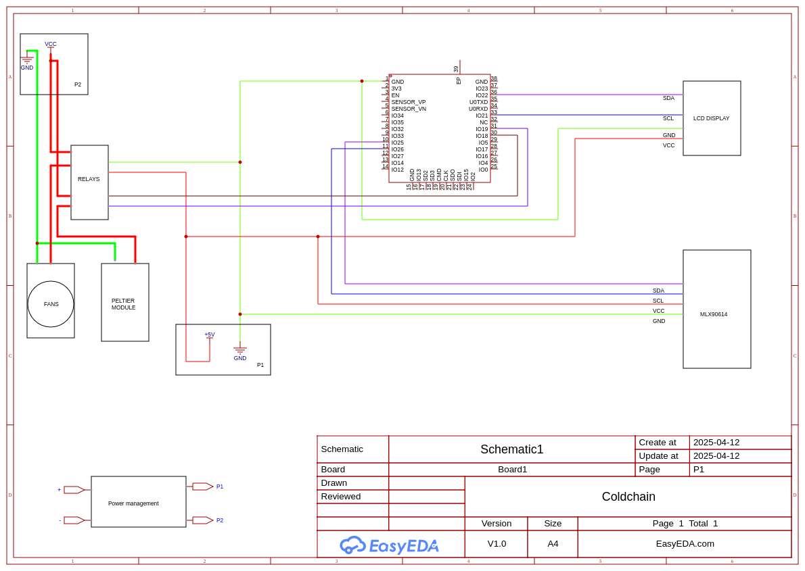

# 🌡️ Cold Chain Monitoring System using ESP32

## Overview

This project implements a Cold Chain Monitoring System using the **ESP32** microcontroller. The goal is to ensure sensitive products like vaccines, pharmaceuticals, and perishable goods are stored and transported within a strict temperature range.

The system continuously monitors temperature and humidity, logs data, and sends alerts if readings go out of the safe range. Data can be accessed via Wi-Fi using a web interface or uploaded to the cloud in future.

---

## 🔧 Features

- ✅ Real-time temperature monitoring
- ✅ OLED display for local status output
- ✅ Wi-Fi web dashboard for temperature setting
- ✅ NVS (non-volatile storage) to save settings
  

---

## 🧰 Hardware Requirements

- ESP32 Dev Board  
- MLX90614 Temperature Sensor  
- SSD1306 OLED Display (I2C)  
- 3.3V Power Supply / Battery
- Peltier module
- Fan
---

